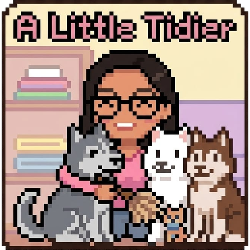

# A Little Tidier ♥

*A cozy little tidying game made with love for **Gail**, starring our three babies —
**Archy**, **Ice** & **Chip** the huskies.*

Drag, straighten and sort everyday things until everything feels **just right**.
No timer, no score, no way to lose — just calm tidying, sparkles, and a howling
husky or three. Inspired by [*A Little to the Left*](https://alittletotheleft.com/),
but built 100% from scratch with original code and art.

---

## 1 · How to get the game

| Way | How | Best for |
|---|---|---|
| 🌐 **Play in the browser** | Open **https://notquacker.github.io/a-little-tidier/** | Phones, tablets, any computer — always the newest version |
| 🖥️ **Windows app** | **[⬇ Download the exe](https://github.com/Notquacker/a-little-tidier/releases/latest)** (under *Assets*) | Playing like a real desktop game |
| 🛠️ **From source** | See [Building it yourself](#building-it-yourself) below | Developers / the curious |

## 2 · How to install

**There is nothing to install.** The Windows app is a *portable* exe:

1. Copy `A Little Tidier 1.0.0.exe` anywhere (Desktop is fine).
2. Double-click it. The first start takes a few extra seconds — it's unpacking itself.
3. If Windows shows a blue **"Windows protected your PC"** screen, that's only because
   the app isn't code-signed (that costs money). Click **More info → Run anyway**. Once.

The app is self-updating in spirit: when you're online it loads the newest version
of the game from the internet, and when you're offline it plays the copy built into
the exe. New levels appear automatically — you never need a new exe.

## 3 · How to play

**Goal:** every level shows something slightly untidy. Make it *just right*.
When something is placed correctly it clicks into place with a chime and a sparkle ✨.
Finish all of them and there might be a message waiting at the end… 💌

**Controls**

| Input | What it does |
|---|---|
| **Drag** an object | Move it (sorting, aligning, placing) |
| **Drag sideways** on a crooked object | Rotate it upright |
| **?** button (top right) | Shows a ghost hint of the solution for a few seconds |
| Click **Archy, Ice or Chip** | Awoooo! 🐺 (they wag and blink on their own) |

**The levels**

1. **Straighten Up** — three crooked picture frames; make them hang straight
2. **Hang Together** — hang the frames on one invisible line
3. **Pencil Parade** — sort the pencils from shortest to tallest
4. **Handle With Care** — set the wonky mugs down straight (one has a paw on it 🐾)
5. **Rainbow Shelf** — sort the books into rainbow order
6. **Treat Time** — sort the dog biscuits from smallest to biggest, one per hungry baby
7. **Drawer Order** — put every piece of cutlery on its matching outline
8. **Love Letters** — spell a very important name ♥

## 4 · How it's made (the nerdy part)

The entire game is **one single file**: [`index.html`](index.html) — hand-written
HTML, CSS and vanilla JavaScript. No frameworks, no libraries, no downloads.

- 🎨 **All the art is code.** Every frame, pencil, mug, biscuit, spoon and husky is an
  inline **SVG drawn by JavaScript functions** — shapes, gradients and paths, zero image
  files. (The only bitmap in the whole project is the app icon above.)
- 🔊 **All the sound is code too.** The chimes, the level fanfare and the husky howl are
  generated live with the **WebAudio API** — oscillators, no audio files.
- 🖥️ **The desktop app is [Electron](https://www.electronjs.org/):** [`main.js`](main.js)
  opens a window and loads the game into it. [`electron-builder`](https://www.electron.build/)
  packs it into a single portable exe. (See [`ELECTRON.md`](ELECTRON.md) for a crash course.)
- 🚀 **Updates are free via GitHub Pages:** this repo *is* the website. Every
  `git push` puts new levels online, and the app loads them on next launch.
  (See [`UPDATES.md`](UPDATES.md).)
- 📋 The game design doc lives in [`PROMPT.md`](PROMPT.md).

Made in 2026 by **Xayvion**, together with Claude (Anthropic) — for Gail,
supervised at all times by Archy, Ice and Chip.

## Building it yourself

```powershell
git clone https://github.com/Notquacker/a-little-tidier.git
cd a-little-tidier
npm install        # fetches Electron & tooling (one time)
npm start          # play as a desktop app
npm run dist       # build the portable exe into dist/
```

Or skip all of that — `index.html` runs by just opening it in a browser. That's the point. 🙂
